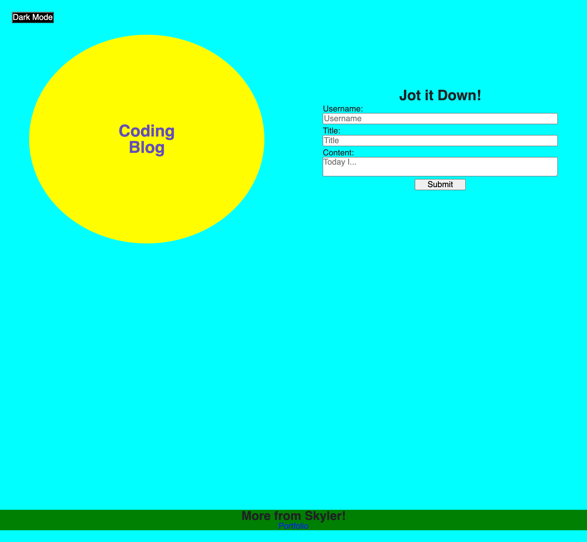

# Coding-Blog
Create a blog where users can store blogs with local data

## Future Features
I'll implement a more elegent way to manage the alert tag when a user incorrectly fills out the form. Currently, the alert will keep appending until the user fills out the form correctly.

I want to add the modeToggle button information to local storage so that the website will remember the mode on page switch vs defaulting to light mode.

I want to fine-tune css more to make the webpage look better in general.

## Current Features
There is a dark mode/light mode button.

Users can enter a blog and it'll post to the blog page using local storage.

Users can click on "Coding Blog" on the form page and it will navigate them to the blog without having to fill out the form.

If the user fills out the form incorrectly, an alert pops up.

[Webpage](https://skylerrhys.github.io/Coding-Blog/index.html)

